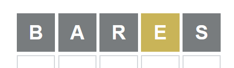

# wordle-solver
Basic wordle solving algorithm, solves with ~95% success rate.

Created in February 2022 when people actually still cared about Wordle.

## How to Use

This game will suggest a word to enter. Enter that word into the wordle webpage.
When the word is 'marked', enter the feedback as 5-digit integer like so: Grey=0, Orange=1, Green=2.

For example: 00001 if the first four letters are grey and the last is orange.
**If the suggested word is not accepted by wordle, simply enter 'X'.**

The above would be entered as 00010

## How it Works

The game has a dictionary of all 5-letter words. When you enter feedback from the site, all the given information is used to eliminate as many words as possible. This algorithm is basic but usually capable of finding the word by the fourth guess.

## How it Could be Improved

- If words in the dictionary were ordered by popularity, the algorithm could be made to always guess the most used word first. This would improve efficiency as often strange words are suggested.
- Word dictionary could be cut down because the 5-words dictionary in this program is far larger than the one used by Wordle, as evidenced by common word rejections.
- Error handling for faulty inputs (I'm not bothered by these)